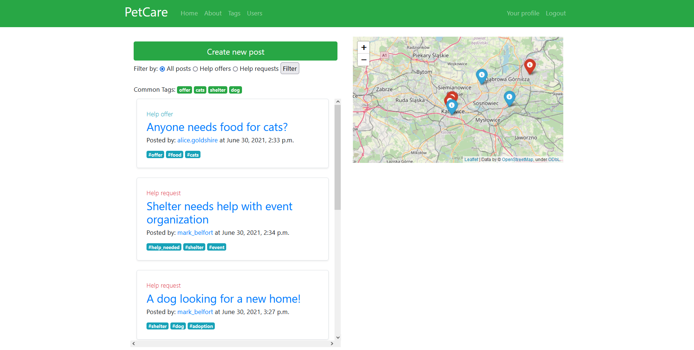
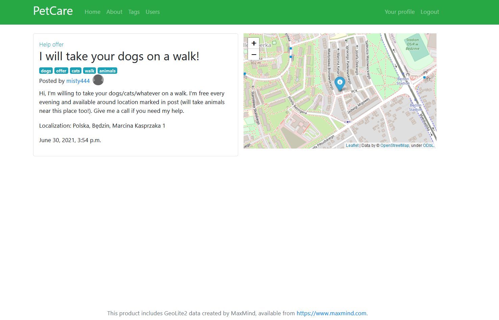
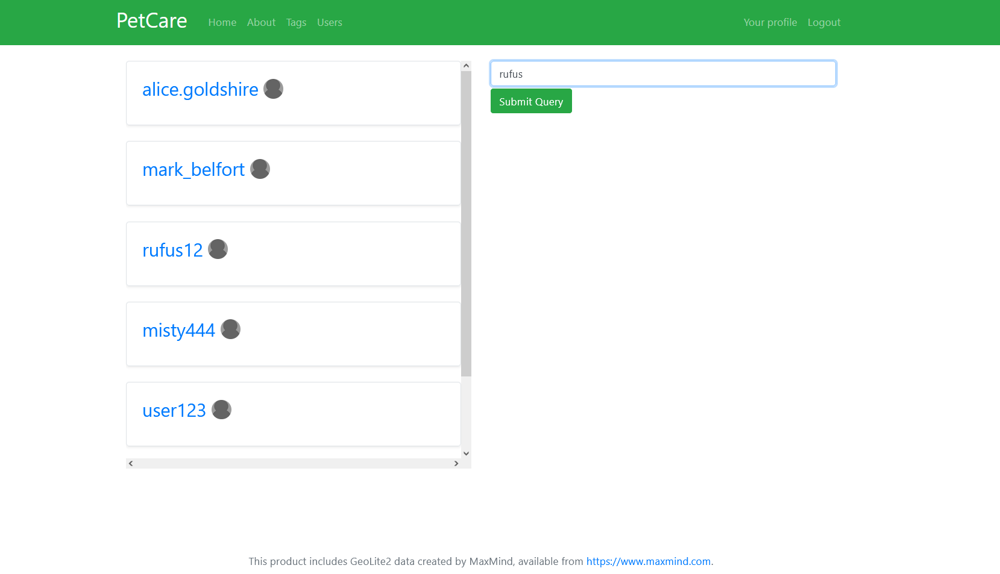
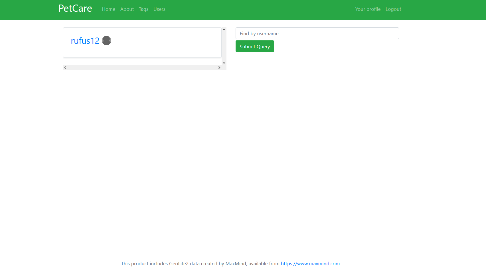
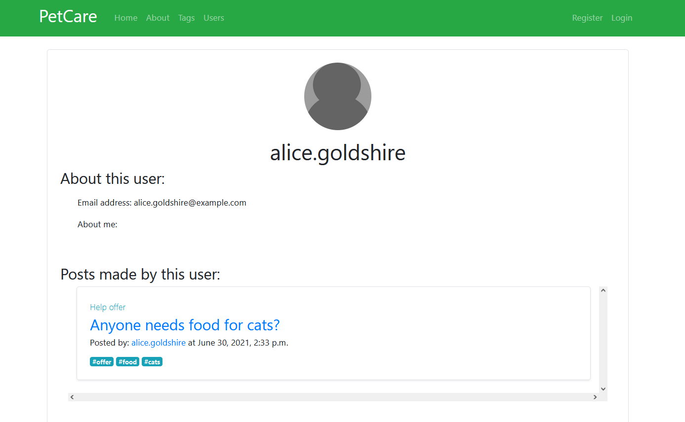
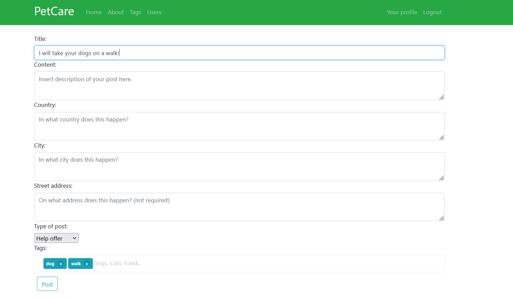

# PetCare: web platform to help animals in need

#

### Used technologies: 
- Python 3.8.5
- Django 3.2
- HTML5, CSS, JavaScript
- Bootstrap 4
- GeoLite2 databases
- Leaflet, OSM data

### Functionality so far:

- for not logged-in user:
    - browsing posts
    - sorting posts by tags
    - seeing post details
    - displaying user profiles (but no access to contact data)
    - registering, logging in
    - access to 'about' page
    - access to post map
    - map initialization on approximated user location (IP geolocation with GeoLite2)
    - browsing comments on user's profiles
    

- for logged-in user:
    - all of above
    - access to contact data on user profiles
    - creating new posts
    - editing created posts
    - deleting created posts
    - customizing user profile (adding more info, profile photo...)
    - adding and removing own comments on users profiles
    
### Some potential features to be implemented:

- internationalization (adding more languages)
- option to edit comments
- password reset module
- deleting account on user request

### Screens:

##### Home screen

#### Post detail screen

#### Users list

#### Users list after filtering results

#### User profile detail screen

#### Post creation form

### Issues:

- map is embedded in the site, meaning everytime user tries to open link in the popum, internet browser may warn him about potential danger.
This is because of a conflict between Bootstrap and Folium libraries (https://github.com/python-visualization/folium/issues/192). May fix in future.

#

Mateusz Safaryjski / MatSaf123 

2021
