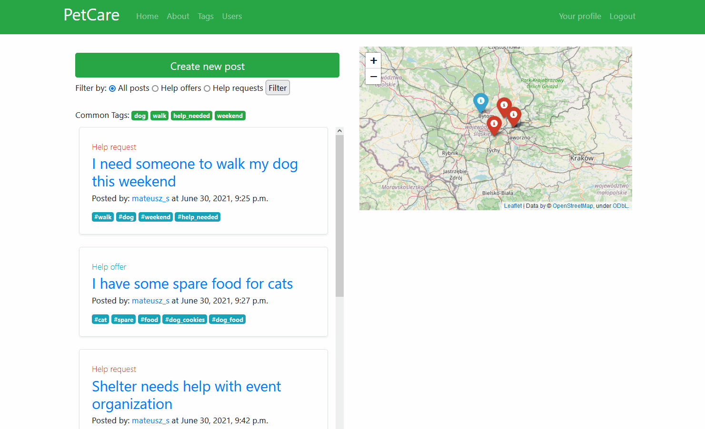
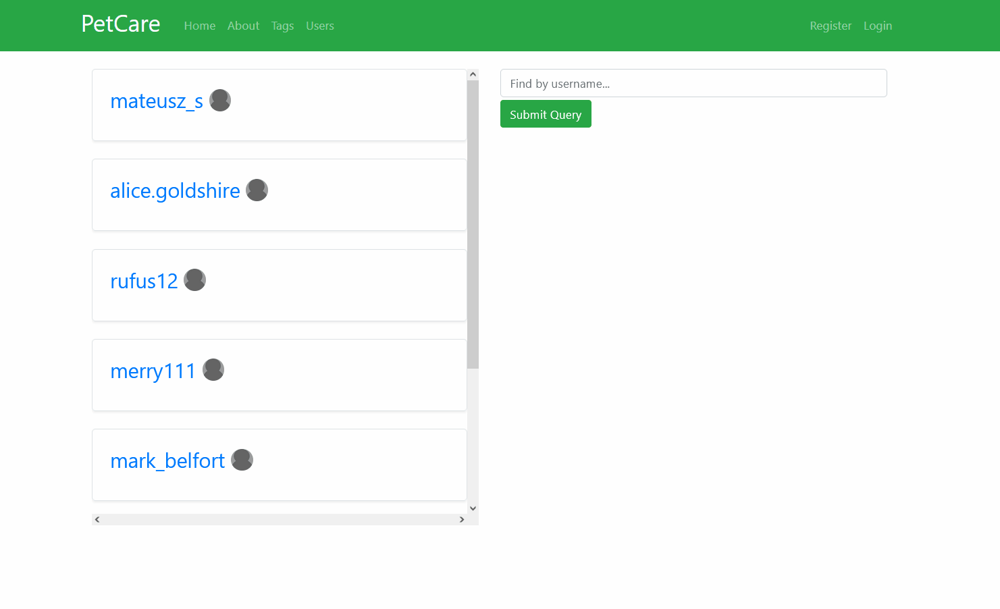
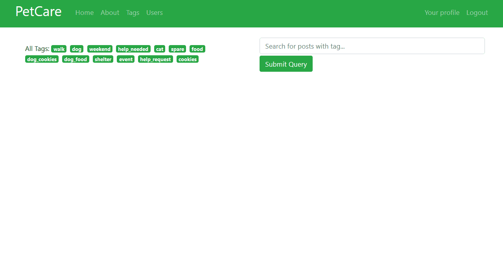

# PetCare: web platform to help animals in need

<p float="left">


</p>

Python-Django powered web platform meant to help organizing volunteer activities towards animals in need, allowing both people in need of help and people willing to help then to communicate and commit to bettering animal lives.

<p align="center">    
</p>

#

## Run

Get PetCare from Github.
```
git clone https://github.com/MatSaf123/pet-care-app.git
```
Create new virtual environment, activate it and install required modules from `requirements.txt` file.

```
python3 -m venv /path/to/new/virtual/environment

source /path/to/new/virtual/environment/bin/activate

pip install -r requirements.txt
```

Create your own PostgreSQL database and connect it to the PetCare, by filling `DATABASES` dictionary in `settings.py`:

```
DATABASES = {
    'default': {
        'ENGINE': 'django.db.backends.postgresql',
        'NAME': 'your_petcare_db',
        'USER': 'your_username',
        'PASSWORD': 'your_password',
        'HOST': 'your_host',
        'PORT': 'your_port'
    }
}
```

Run migrations.

```
python manage.py makemigrations

python manage.py migrate
```

Get MaxMind GeoLite2 databases from https://dev.maxmind.com/geoip/geolite2-free-geolocation-data and put them into /geoip directory. Required databases:

- GeoLite2-City.mmdb
- GeoLite2-Country.mmdb


Optionally, Create superuser to access admin panel.

```
python manage.py createsuperuser
```

Finally, run server.

```
python manage.py runserver
```
#


## Used technologies: 
- Python 3.8.5
- Django 3.2
- HTML5, CSS, JavaScript
- Bootstrap 4
- GeoLite2 databases
- Leaflet, OSM data

#

## Functionality so far:

- for not logged-in user:
    - browsing posts
    - sorting posts by tags
    - seeing post details
    - displaying user profiles (but no access to contact data)
    - registering, logging in
    - access to 'about' page
    - access to post map
    - map initialization on approximated user location (IP geolocation with GeoLite2)
    - browsing comments on user's profiles
    - filtering posts, tags, profiles


- for logged-in user:
    - all features above
    - access to contact data on user profiles
    - creating new posts
    - editing created posts
    - deleting created posts
    - customizing user profile (adding more info, profile photo...)
    - adding and removing own comments on users profiles

#

## Some potential features to be implemented:

- internationalization (adding more languages)
- option to edit comments
- password reset module
- deleting account on user request

## Screens:

### Home screen

Posts list on the left, alongside post creation button, sorting form and a set of most popular tags. On the right: interactive map representing posts from the list (their locations) .

<p align="center">
    
</p>

### Post detail screen

Contains all the details and informations about picked post; author's username redirects to his profile.

<p align="center">
    
</p>

### Post creation process

The whole process of adding a new post by a registered, logged in user.

<p align="center">
    
</p>

### Users section and user profile detail screen

List of users on the left, sorting form on the right. Also, user unique profile with list of posts created by him and comments on him added by other users.

<p align="center">
    
</p>


### Tags screen

All tags available are listed here.

<p align="center">
    
</p>

#

## Warning

Application may look a little different from what can be seen on GIFs/screens due to some minor changes, but it's core features and overall characteristics stay the same. 

#

## Legal notes:

This product includes GeoLite2 data created by MaxMind, available from <a href="https://www.maxmind.com">https://www.maxmind.com</a>.

Map technology powered by <a href="https://leafletjs.com/">Leaflet</a> and <a href="https://www.openstreetmap.org">OpenStreetMaps</a>.

#

<p align="center">
    
</p>

Mateusz Safaryjski / MatSaf123 

2021
